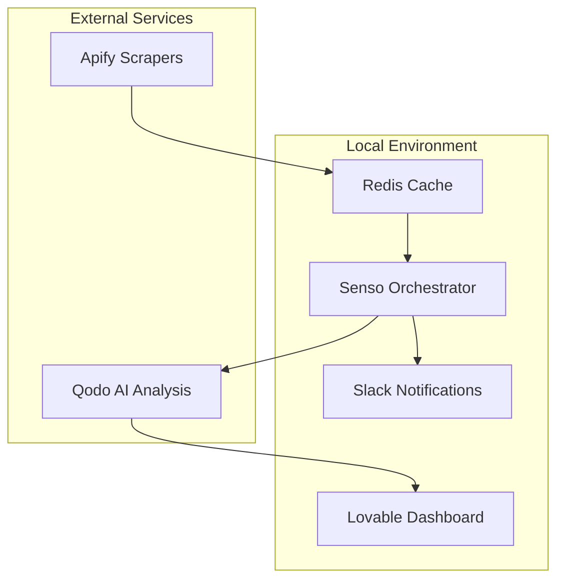

# Design Document

## Overview

The AI Regulatory Compliance Monitor is a locally-hosted system that combines multiple technologies to create an automated regulatory monitoring solution for the Oil & Gas industry. The system follows a microservices-like architecture running on a single laptop for hackathon demonstration, with each component handling specific responsibilities in the compliance monitoring pipeline.

## Architecture

### High-Level Architecture



### Component Interaction Flow

1. **Data Collection**: Apify scrapers run on scheduled intervals to collect regulatory data
2. **Storage & Deduplication**: Redis stores new data and performs change detection
3. **Orchestration**: Senso triggers analysis workflows when changes are detected
4. **AI Processing**: Qodo analyzes regulatory text and generates insights
5. **User Interface**: Lovable dashboard displays processed information
6. **Notifications**: Slack alerts are sent for high-priority items

## Components and Interfaces

### 1. Data Collection Layer (Apify)

**Purpose**: Automated web scraping of regulatory sources

**Key Features**:
- Scheduled scraping of EPA, DOE, state agencies, and industry bodies
- Structured data extraction (title, date, URL, full text)
- Error handling and retry mechanisms
- Rate limiting to respect source websites

**API Interface**:
```javascript
// Apify Actor Configuration
{
  "sources": [
    "https://www.epa.gov/regulations",
    "https://www.energy.gov/policy",
    // Additional regulatory sources
  ],
  "schedule": "0 */6 * * *", // Every 6 hours
  "outputFormat": "json"
}

// Output Schema
{
  "id": "unique_identifier",
  "title": "Regulation Title",
  "date": "2025-01-08",
  "url": "source_url",
  "fullText": "complete_regulation_text",
  "source": "EPA",
  "scrapedAt": "2025-01-08T10:00:00Z"
}
```

### 2. Data Pipeline & Storage (Redis)

**Purpose**: Fast storage, deduplication, and change tracking

**Key Features**:
- In-memory storage for rapid access
- Hash-based duplicate detection
- Change history tracking
- Pub/Sub for real-time notifications

**Data Structures**:
```redis
# Regulation Storage
HSET regulation:{id} title "..." date "..." url "..." text "..." source "..."

# Duplicate Detection
SET regulation_hash:{hash} {id}

# Change Tracking
ZADD changes_timeline {timestamp} {regulation_id}

# Notification Queue
LPUSH pending_analysis {regulation_id}
```

### 3. Orchestration & Automation (Senso MCP Server)

**Purpose**: Workflow coordination and process automation using Model Context Protocol

**Key Features**:
- MCP-based workflow orchestration with Senso server
- Event-driven workflow triggers through MCP tools
- Multi-step process coordination via Senso MCP capabilities
- Built-in error handling and retry logic from Senso MCP
- Comprehensive audit logging and workflow state management

**MCP Configuration**:
```json
{
  "mcpServers": {
    "senso": {
      "command": "uvx",
      "args": ["senso-mcp-server@latest"],
      "env": {
        "SENSO_LOG_LEVEL": "INFO"
      },
      "disabled": false,
      "autoApprove": ["workflow_execute", "workflow_status", "workflow_create"]
    }
  }
}
```

**Workflow Definition via Senso MCP**:
```javascript
// Using Senso MCP tools to define regulatory processing workflow
await senso.createWorkflow({
  name: "regulatory_processing",
  trigger: {
    type: "event",
    event: "new_regulation_detected"
  },
  steps: [
    {
      name: "validate_data",
      tool: "data_validator",
      params: { schema: "regulation_schema" }
    },
    {
      name: "ai_analysis", 
      tool: "qodo_analyzer",
      retry: { attempts: 3, delay: 1000 },
      params: { analysis_type: "regulatory_compliance" }
    },
    {
      name: "risk_assessment",
      tool: "risk_calculator",
      params: { industry: "oil_and_gas" }
    },
    {
      name: "notification",
      tool: "slack_notifier",
      condition: "priority >= 'high'",
      params: { channel: "#compliance-alerts" }
    },
    {
      name: "dashboard_update",
      tool: "dashboard_refresh",
      params: { update_type: "new_regulation" }
    }
  ]
});
```

### 4. AI Intelligence & Summarization (Qodo)

**Purpose**: Intelligent analysis and insight generation

**Key Features**:
- Regulatory text summarization
- Impact analysis and risk scoring
- Actionable insight extraction
- Compliance checklist generation

**Analysis Pipeline**:
```javascript
// Qodo Analysis Request
{
  "text": "regulatory_content",
  "analysis_type": "regulatory_compliance",
  "industry": "oil_and_gas",
  "output_format": {
    "summary": true,
    "risk_score": true,
    "action_items": true,
    "affected_parties": true
  }
}

// Qodo Response Schema
{
  "summary": "Concise regulation summary",
  "risk_score": 8.5,
  "priority": "high",
  "insights": {
    "what_changed": "New emission standards",
    "who_impacted": "Offshore drilling operations",
    "required_actions": ["Update procedures", "Train staff"]
  },
  "compliance_checklist": [
    "Review current emission monitoring",
    "Update safety protocols"
  ]
}
```

### 5. User Experience & Dashboard (Lovable)

**Purpose**: Intuitive web interface for compliance management

**Key Features**:
- Real-time regulatory updates display
- Interactive regulation details
- Action item management
- Historical data browsing
- Mobile-responsive design

**UI Components**:
- **Homepage**: Latest regulations with risk indicators
- **Detail View**: Full regulation with AI analysis
- **Action Dashboard**: Pending tasks and status tracking
- **History Panel**: Searchable regulation archive
- **Admin Panel**: System logs and configuration

**Component Structure**:
```jsx
// Main Dashboard Components
<Dashboard>
  <RegulationFeed regulations={latest} />
  <ActionItems items={pending} />
  <RiskIndicators alerts={highPriority} />
</Dashboard>

<RegulationDetail>
  <OriginalText content={regulation.text} />
  <AISummary analysis={qodoResults} />
  <ActionRecommendations items={checklist} />
</RegulationDetail>
```

### 6. Notifications & Alerts (Slack Integration)

**Purpose**: Real-time alerting for critical regulatory changes

**Key Features**:
- Instant Slack notifications for high-risk regulations
- Rich message formatting with action buttons
- Channel-based routing by regulation type
- Notification preferences management

**Slack Integration**:
```javascript
// Slack Message Format
{
  "channel": "#compliance-alerts",
  "blocks": [
    {
      "type": "header",
      "text": "🚨 High Priority Regulation Alert"
    },
    {
      "type": "section",
      "fields": [
        {"type": "mrkdwn", "text": "*Source:* EPA"},
        {"type": "mrkdwn", "text": "*Risk Score:* 8.5/10"},
        {"type": "mrkdwn", "text": "*Effective Date:* 2025-03-01"}
      ]
    },
    {
      "type": "actions",
      "elements": [
        {"type": "button", "text": "View Details", "url": "dashboard_url"},
        {"type": "button", "text": "Mark Reviewed"}
      ]
    }
  ]
}
```

## Data Models

### Regulation Model
```typescript
interface Regulation {
  id: string;
  title: string;
  date: Date;
  url: string;
  fullText: string;
  source: string;
  scrapedAt: Date;
  hash: string;
  
  // AI Analysis Results
  summary?: string;
  riskScore?: number;
  priority?: 'low' | 'medium' | 'high' | 'critical';
  insights?: {
    whatChanged: string;
    whoImpacted: string[];
    requiredActions: string[];
  };
  complianceChecklist?: string[];
  
  // Tracking
  status: 'new' | 'analyzed' | 'reviewed' | 'archived';
  assignedTo?: string;
  reviewedAt?: Date;
}
```

### Workflow State Model
```typescript
interface WorkflowState {
  regulationId: string;
  currentStep: string;
  status: 'pending' | 'processing' | 'completed' | 'failed';
  startedAt: Date;
  completedAt?: Date;
  errors?: string[];
  retryCount: number;
}
```

## Error Handling

### Graceful Degradation Strategy
1. **Apify Failures**: Use cached data and retry with exponential backoff
2. **Redis Unavailable**: Fall back to file-based storage temporarily
3. **Qodo API Issues**: Display raw text with basic keyword highlighting
4. **Slack Failures**: Log notifications for manual review
5. **Lovable UI Errors**: Show error boundaries with fallback content

### Monitoring and Logging
- Centralized logging with structured JSON format
- Error tracking with context and stack traces
- Performance metrics for each component
- Health check endpoints for system status

## Testing Strategy

### Unit Testing
- Individual component functionality
- Data model validation
- API integration mocks
- Error handling scenarios

### Integration Testing
- End-to-end workflow validation
- Cross-component communication
- External service integration
- Data consistency checks

### Demo Testing
- Complete user journey scenarios
- Performance under demo conditions
- Fallback mechanism validation
- UI responsiveness across devices

### Test Data Strategy
- Sample regulatory documents for consistent testing
- Mock API responses for offline development
- Synthetic data for load testing
- Real data samples for accuracy validation

## Performance Considerations

### Local Environment Optimization
- Redis memory usage monitoring
- Efficient data structures for fast queries
- Lazy loading for large regulation texts
- Caching strategies for repeated operations

### Demo Performance
- Pre-loaded sample data for instant responses
- Optimized UI rendering for smooth interactions
- Background processing to avoid UI blocking
- Fallback to cached results if services are slow

## Security Considerations (Post-Hackathon)

### Data Protection
- Sensitive regulation data handling
- API key management
- Local storage encryption
- Audit trail maintenance

### Access Control
- User authentication system
- Role-based permissions
- API rate limiting
- Secure communication protocols

## Deployment Architecture (Local)

### Development Setup
```bash
# Local Services
docker-compose up -d redis
npm start # Lovable dashboard
npm run api # REST API server

# MCP Server Configuration
# Configure Senso MCP server in .kiro/settings/mcp.json
# Senso MCP server will be auto-started by Kiro when workflows are executed

# External Services
# Apify actors (cloud-hosted)
# Qodo API (cloud-hosted)
# Senso MCP server (auto-managed via uvx)
```

### Demo Environment
- All services running on single laptop
- Docker containers for consistent environment
- Local Redis instance for data storage
- Mock data for reliable demonstrations
- Backup scenarios for network issues